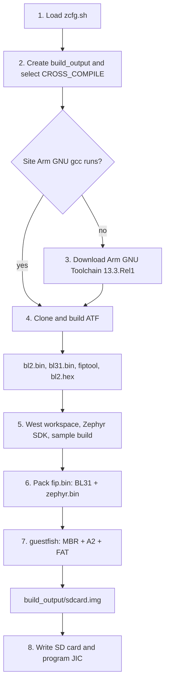

# ryo_zephyr_sd

Build an SD card boot image for Altera Agilex 5 HPS. The image demonstrates HPS-first boot. ATF and Zephyr do not configure the FPGA core fabric.

## Usage

Host requirements:

- Linux (Ubuntu 22.04 or newer recommended)
- Network access to clone ATF and Zephyr and to download toolchains
- About 20 GB free disk space
- `git`, `python3`, and either `wget` or `curl`
- [Zephyr Linux host dependencies](https://docs.zephyrproject.org/latest/develop/getting_started/installation_linux.html)
- `guestfish` from `guestfs-tools` / `libguestfs-tools` (the script tries `apt-get` if it is missing)

From the repository root:

```bash
chmod +x build_zephyr.sh
./build_zephyr.sh
```

Edit `zcfg.sh` first if you need a different ATF branch, Zephyr branch, board, or sample. The script reads that file and stops if it is missing.

The SD card image is written to `build_output/sdcard.img`. `bl2.hex` for the JIC is written under `build_output/arm-trusted-firmware/build/agilex5/release/bl2.hex`.

## Script flow



1. **Configuration.** Source `zcfg.sh` and print the ATF branch, Zephyr branch, board, and sample.
2. **Build directory.** Create `build_output/` and export `ARCH=arm64`.
3. **ARM GNU toolchain.** If `/nfs/site/disks/psg_ctools_1/arm_gnu/linaro/aarch64/13.3/1/bin/aarch64-none-linux-gnu-gcc` runs, that site compiler is `CROSS_COMPILE`. Otherwise download Arm GNU Toolchain 13.3.Rel1 (`aarch64-none-linux-gnu`, x86_64 host) into `build_output/` and use it only after `gcc --version` succeeds. Set `ATF_TOOLCHAIN_BIN` to another `bin` directory to override the site path, or to a missing path to force the download. Downloads keep `http_proxy` and `https_proxy` when those are already set. When they are empty and `proxy-dmz.altera.com` resolves, the script uses `http://proxy-dmz.altera.com:912`.
4. **ATF.** Clone `ATF_REPO` at `ATF_BRANCH` into `build_output/arm-trusted-firmware` if that directory is absent. Build `bl2`, `bl31`, and `fiptool` for `PLAT=agilex5` with `PRELOADED_BL33_BASE=0x80100000`. Convert `bl2.bin` to `bl2.hex`.
5. **Zephyr.** Create a virtualenv under `build_output/zephyr-socfpga`, install `west` with a local pip cache, run `west init` / `west update` / `west zephyr-export` / `west packages pip --install`, install the Zephyr SDK (`aarch64-zephyr-elf`), and build `ZEPHYR_SAMPLE` for `ZEPHYR_BOARD`. The image is `zephyr.bin`.
6. **FIP.** `fiptool create --soc-fw bl31.bin --nt-fw zephyr.bin` writes `build_output/fip.bin`.
7. **SD card image.** `guestfish` creates a 64 MB MBR image. Partition 1 is type `0xA2`, 16 MB, and holds the raw FIP. Partition 2 is FAT (`0x0B`) and fills the rest of the image. There is no ext4 partition. If `guestfish` fails under nested virtualization, rerun with `LIBGUESTFS_BACKEND=direct`.
8. **Boot.** Write the image to an SD card, then program a JIC that pairs a GHRD `.sof` with `bl2.hex`.

## Write the card and boot

Replace `/dev/sdX` with the SD card device:

```bash
sudo dd if=build_output/sdcard.img of=/dev/sdX bs=1M status=progress
```

Insert the card into the Agilex 5 board. Generate a JIC from the GHRD SOF and `bl2.hex`, then program it and power-cycle. The device and flash loader below match the example printed by the script; change them for your board:

```bash
quartus_pfg \
    -c sof_filename.sof output_file.jic \
    -o device=MT25QU128 \
    -o flash_loader=A5ED065BB32AE6SR0 \
    -o hps_path=build_output/arm-trusted-firmware/build/agilex5/release/bl2.hex \
    -o mode=ASX4 \
    -o hps=1

quartus_pgm -c 1 -m jtag -o "pvi;output_file.jic"
```

## Configuration

`zcfg.sh` supplies the sources and the Zephyr target:

| Variable | Role | Default in this tree |
| --- | --- | --- |
| `ATF_REPO` | ATF git URL | `applications.fpga.soc.arm-trusted-firmware-dev` |
| `ATF_BRANCH` | ATF branch | `socfpga_v2.14.1` |
| `ATF_DIR` | Clone directory under `build_output/` | `arm-trusted-firmware` |
| `ZEPHYR_REPO` | Zephyr git URL | `os.rtos.zephyr.socfpga.zephyr-socfpga` |
| `ZEPHYR_BRANCH` | Zephyr branch | `socfpga_v4.3.0` |
| `ZEPHYR_DIR` | West workspace parent | `zephyr-socfpga` |
| `ZEPHYR_BOARD` | `west build -b` board | `intel_socfpga_agilex5_socdk` |
| `ZEPHYR_SAMPLE` | Sample path | `samples/boards/intel_socfpga/cli` |
